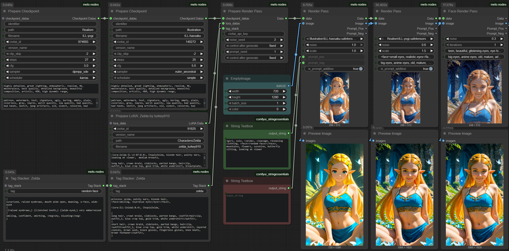

These nodes aim to enable workflows involving complex prompt randomization, and chaining the renders of multiple different checkpoints together.

You can drag [this](docs/example.png) image into ComfyUI for an example workflow showing off most of the features.

## Intended Workflow:
- Chain together Render Pass nodes with different checkpoints. Eg., one model might work well with a LoRA, but you want to use the style of another model. Or one anime checkpoint is great at generating a pose you like, but you want to then render over it with a realistic checkpoint.
- Randomize your prompt in a highly controlled way by defining "tags", which you can reference in your prompt to replace a keyword with all the prompt words that describe it. For example, once you define a prompt which describes a character, you can always bring that character into your prompt with a single keyword, eg. `<miku>`. You can also define random variations within these tags, such as different outfits, hairstyles, etc, with the usual `{option a|option b}` syntax.

## Nodes
#### Render Pass
This node includes a sampler, and is designed to be chainable, to allow conveniently building a workflow which chains multiple checkpoints together. For example, your first Render Pass could take an Empty Image as an input, and fully replace it with noise (txt2img), and then a 2nd render pass can take the result, upscale by 50%, and add 50% noise (img2img).

#### Face Render Pass
Same as Render Pass but uses the FaceDetailer implementation from Impact Pack/Subpack. You need both of those installed.

#### Prepare Render Pass
Combines data from the below nodes, and lets you provide a CivitAI API key (which you can get [here](https://civitai.com/user/account)) which allows automatic download of missing LoRAs. This does not work with Checkpoints due to frontend limitations.
It also provides two seed values; One for the noise, and one for the prompt randomization. All of this combined can provide the Render Pass node with everything it needs to make your prompting and workflow sharing more convenient.

**Built-in tags:**
- `<!>this text</!>` will be moved to the top of the prompt, making it more likely that it will be adhered to.
- `<neg>this text</neg>` will be moved to the negative prompt.
- `<face>this text</face>` will be sent to the Face Render Pass node's prompt.
- You can also define arbitrary tags, for example, let's say you want to be able to exclude eyes without having to delete them from the prompt every time: `<eye>blue eyes</eye>`. Then, you can include `<!eye>` in your prompt, which will cause the contents of any <eye> tags to be excluded from the final prompt.
- `<ratio:landscape>`/`<ratio:square>`/`<ratio:portrait>` will override your image resolution by flipping or averaging your starting image's width/height.
- `<!modelprompt>` will exclude the base prompt associated with the checkpoint, which is defined in the Prepare Checkpoint node, and is normally prepended to your prompt.

#### Tag Stacker
Make a single "tag" available in your prompt. For example, lets you define a tag called `random clothes` with the contents `{jacket|shirt|tanktop|bikini}`. Later, if you type `<random clothes>` in the prompt for the RenderPass node, it will replace that tag with the provided contents.
- This node can be chained together to build up a database of tags.
- Tags can also include tags (Avoiding infinite loops is up to you!)

#### Tag Tweaker
Search & replace in your tag database. Useful if you find yourself typing out combinations of prompt elements often, but don't want to define a tag for them, because you don't want to use them in your final prompt.
Eg., you can replace `blink` with `blink <!eye>`, which in combination with the `<eye>` tag example mentioned above, can let you add blinks without having to manually remove the eye-related words from your prompt.

#### Prepare Checkpoint
Can be chained together just like Tag Stacker to define a database of checkpoints. Inputs:
- (required) CivitAI model ID
- Model version name
- Override filename
- Positive/Negative prompts associated with this checkpoint. This allows you to switch to a different checkpoint without having to change your quality tags, eg., so you can switch between Pony and non-Pony models more easily.
- CFG, Steps, Scheduler, Sampler, the usual suspects.

These values will be used by the RenderPass node when the corresponding checkpoint is selected.

#### Prepare LoRA
Same as Prepare Checkpoint, but for LoRAs. You can activate LoRAs by adding them to your prompt with this syntax: `<lora:MyLora:1.0>`. You do not need the full filepath, nor the file extension, although only `.safetensors` is supported. The file just needs to exist in your `ComfyUI/models/loras/` directory. If a LoRA is not present but its model ID is provided through this node (and an API key is provided), it will be automatically downloaded.

#### Adjust Image
Simple Brightness/Contrast/Saturation adjuster. I highly recommend reducing all 3 between render steps, especially for night-time images.

#### Misc Nodes
The functionality of these nodes is built into the RenderPass node, but you can also use them outside of that framework, if you so wish.
- **CivitAI Model Downloader**: I wasn't happy with the one that's online so I made my own. You can enter a model ID, your API key, a desired folder path, file name, and even model version name, and it will download it. Will automatically place checkpoints and LoRAs in the appropriate folders.
- **Stable Random Choice**: I wasn't happy with how ComfyUI or WildCardProcessor handles randomized elements of a prompt, such as {red|green|blue}, particularly when a lot of such randomized elements were in a prompt. When you modify the prompt without adding or removing any randomized elements, you might get a totally different result. Not with this node. Only if you add or remove random elements.
- **Tidy Prompt**: Adds commas at end of lines, removes lines starting with `#`, remove excess commas.
- **Extract Tag From String**: Kinda like an HTML tag, eg. if the input string is `a girl with <eye>blue eyes</eye>`, this node will extract the `blue eyes` part if you ask it to extract the `eye` tag. Useful for not having to jump between so many different input boxes for prompts, since you can eg. use <neg>to send stuff to your negative prompt</neg> or <face>to send stuff to your FaceDetailer prompt</face>.
- **Auto Extract Tags** From String: Good to run at the end of your other tag processing nodes, to remove any leftovers. Additionally, if the input contains a tag with an ! like `<!eye>` then the contents of any <eye> tags will be removed. You could use this to replace `blink` in your prompt with `blink <!eye>`, so when you want to quickly make your character blink, you can just add "blink" to your prompt and it will automatically remove any descriptions of eyes. (As long as your eyes are tagged properly)
- **Regex Operations**: Exactly that.
